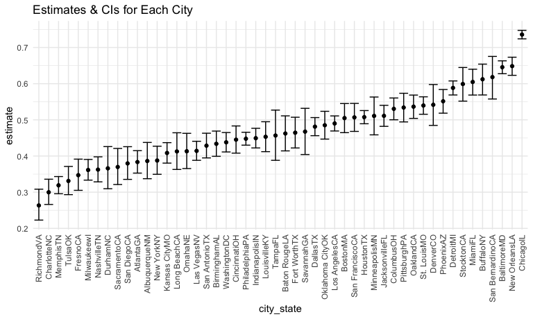
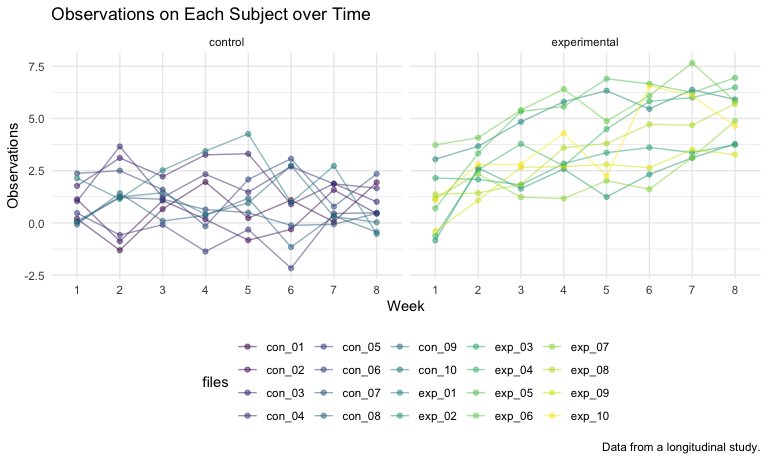

p8105\_hw5\_yc4018
================
Yuxuan Chen

``` r
library(tidyverse)

#set the figures' size
knitr::opts_chunk$set(
  fig.width = 8,
  fig.asp = .6,
  out.width = "90%"
)

#set the theme of all graphs
theme_set(theme_minimal() + theme(legend.position = "bottom"))

#set color of all graphs
options(
  ggplot2.continuous.colour = "viridis", 
  ggplot2.continuous.fill = "viridis"
)

scale_colour_discrete = scale_colour_viridis_d
scale_fill_discrete = scale_fill_viridis_d
```

**Problem 1**  
1. load and clean dataset

``` r
homicide_df = 
  read.csv("./data/homicide-data.csv", na = c("", "Unknown")) %>% # let `Unknown` or `` as missing values
  mutate(
    city_state = str_c(city, state), # combine as `city, state`
    resolution = case_when(
      disposition == "Closed without arrest" ~ "unsolved",
      disposition == "Open/No arrest" ~ "unsolved",
      disposition == "Closed by arrest" ~ "solved"
      )) %>% 
  relocate(city_state) %>% 
  filter(city_state != "TulsaAL") 

summarize_df = 
  homicide_df %>% 
  group_by(city_state) %>% 
  summarize(
    unsolved = sum(resolution == "unsolved"),
    n = n()
  )

knitr::kable(summarize_df[0:7,])
```

| city\_state   | unsolved |    n |
|:--------------|---------:|-----:|
| AlbuquerqueNM |      146 |  378 |
| AtlantaGA     |      373 |  973 |
| BaltimoreMD   |     1825 | 2827 |
| Baton RougeLA |      196 |  424 |
| BirminghamAL  |      347 |  800 |
| BostonMA      |      310 |  614 |
| BuffaloNY     |      319 |  521 |

2.  focus on Baltimore, MD dataset:

``` r
# prop.test(x = # unsolved, n = # homicides)

baltimore_df = 
  homicide_df %>% 
  filter(city_state == "BaltimoreMD")
 
baltimore_summary =  
  baltimore_df %>% 
  summarize(
    unsolved = sum(resolution == "unsolved"),
    n = n()
  )

baltimore_test = 
  prop.test(
  x = baltimore_summary %>% pull(unsolved), 
  n = baltimore_summary %>% pull(n)) %>% 
  broom::tidy() %>%  # take the output as dataframe, easier to access the data.
  select(estimate, starts_with("conf"))

baltimore_test
```

    ## # A tibble: 1 × 3
    ##   estimate conf.low conf.high
    ##      <dbl>    <dbl>     <dbl>
    ## 1    0.646    0.628     0.663

3.  Iterate across cities:

``` r
# write a function

prop_test_function = function(city_df){
  
  city_summary =  
    city_df %>% 
    summarize(
      unsolved = sum(resolution == "unsolved"),
      n = n()
    )
  
  city_test = 
    prop.test(
    x = city_summary %>% pull(unsolved), 
    n = city_summary %>% pull(n)) 
  
  return(city_test)
  
}

# nest the data

results_df = 
  homicide_df %>% 
  nest(data = uid:resolution) %>% 
  mutate(
    test_results = map(data, prop_test_function), #run `prop_test_function` function to every dataset in `data` and saved as `test_results`
    tidy_results = map(test_results, broom::tidy)
  ) %>% 
  select(city_state, tidy_results) %>% 
  unnest(tidy_results) %>% 
  select(city_state, estimate, starts_with("conf"))

knitr::kable(results_df[0:7,])
```

| city\_state   |  estimate |  conf.low | conf.high |
|:--------------|----------:|----------:|----------:|
| AlbuquerqueNM | 0.3862434 | 0.3372604 | 0.4375766 |
| AtlantaGA     | 0.3833505 | 0.3528119 | 0.4148219 |
| BaltimoreMD   | 0.6455607 | 0.6275625 | 0.6631599 |
| Baton RougeLA | 0.4622642 | 0.4141987 | 0.5110240 |
| BirminghamAL  | 0.4337500 | 0.3991889 | 0.4689557 |
| BostonMA      | 0.5048860 | 0.4646219 | 0.5450881 |
| BuffaloNY     | 0.6122841 | 0.5687990 | 0.6540879 |

4.  plot showing estimates and confidence intervals

``` r
results_df %>% 
  mutate(city_state = fct_reorder(city_state, estimate)) %>% 
  ggplot(aes(x = city_state, y = estimate)) +
  geom_point() +
  geom_errorbar(aes(ymin = conf.low, ymax = conf.high)) +
  theme(axis.text.x = element_text(angle = 90, vjust = 0.5, hjust = 1))
```



Another way to do Problem 1:

``` r
homicide_df %>% 
  group_by(city_state) %>% 
  summarize(
    unsolved = sum(resolution == "unsolved"),
    n = n()
  ) %>% 
  mutate(
    test_results = map2(unsolved, n, prop.test), # by using map2 to make `prop.test`function: unsolved/n
    tidy_results = map(test_results, broom::tidy)
  ) %>% 
  select(city_state, tidy_results) %>% 
  unnest(tidy_results) %>% 
  select(city_state, estimate, starts_with("conf"))
```

------------------------------------------------------------------------

**Problem 2**

1.  Create a tidy dataframe including the subject ID, arm, and
    observations over time:

``` r
all_file = 
  tibble(files = list.files("./data/problem2_data/"))

read_csv_function = function(participant_file){
  
    participant_csv = str_c("./data/problem2_data/", participant_file)
    
    participant_data = read_csv(participant_csv)

  return(participant_data)
}

long_study_df = 
  all_file %>% 
  mutate(
    csv_results = map(files, read_csv_function)) %>% 
  unnest(csv_results) %>% 
  separate(files, into = c("arm", "id"), remove = F) %>% 
  mutate(
    arm = recode(arm, "con" = "control", "exp" = "experimental"),
    files = str_replace(files, ".csv", ""))
```

2.  make the spaghetti plot showing observations on each subject over
    time:

``` r
long_study_df %>% 
  pivot_longer(
    week_1:week_8,
    names_to = "week",
    names_prefix = "week_",
    values_to = "observation"
  ) %>% 
  ggplot(aes(x = week, y = observation, group = files, color = files)) +
  geom_point(alpha = .5) +
  geom_line(alpha = .5) +
  facet_grid(. ~ arm) +
  labs(
    title = "Observations on Each Subject over Time",
    x = "Week",
    y = "Observations",
    caption = "Data from a longitudinal study."
  ) 
```



-   Based on the above spaghetti plot that shows the observations on
    each subject over time, we can see that in the first week, the
    observations in the experimental group are slightly higher, but
    mostly around the same, as the control group. From week 1 to week 8,
    the observation values in the experimental group are increasing but
    barely change in the control group. So at week 8, the observation
    values in the experimental group are larger compared to the control
    group. Hence, overall, observations in the control group are smaller
    than the observations in the experimental group.

------------------------------------------------------------------------

**Problem 3**

``` r
library(tidyverse)

set.seed(10)

iris_with_missing = iris %>% 
  map_df(~replace(.x, sample(1:150, 20), NA)) %>%
  mutate(Species = as.character(Species))
```

For numeric variables, you should fill in missing values with the mean
of non-missing values For character variables, you should fill in
missing values with “virginica” 1.

``` r
na_function = function(z){
  if (is.numeric(z)) {
    z = ifelse(is.na(z), mean(z, na.rm = TRUE), z)
  }
  if (is.character(z)) {
    z = ifelse(is.na(z), "virginica", z)
  }
  
  return(z)
}
```
